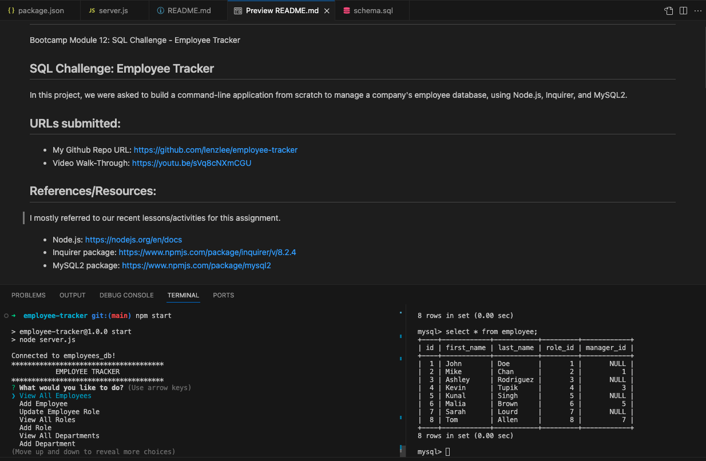

# employee-tracker
Bootcamp Module 12: SQL Challenge - Employee Tracker

## SQL Challenge: Employee Tracker
In this project, we were asked to build a command-line application from scratch to manage a company's employee database, using Node.js, Inquirer, and MySQL2.

## URLs submitted:
* My Github Repo URL: https://github.com/lenzlee/employee-tracker
* Video Walk-Through: https://youtu.be/sVq8cNXmCGU 

## References/Resources:
I mostly referred to our recent lessons/activities for this assignment. 

 * Node.js: https://nodejs.org/en/docs
 * Inquirer package: https://www.npmjs.com/package/inquirer/v/8.2.4
 * MySQL2 package: https://www.npmjs.com/package/mysql2 

## Acceptance Criteria:
* GIVEN a command-line application that accepts user input
* WHEN I start the application
* THEN I am presented with the following options: view all departments, view all roles, view all employees, add a department, add a role, add an employee, and update an employee role
* WHEN I choose to view all departments
* THEN I am presented with a formatted table showing department names and department ids
* WHEN I choose to view all roles
* THEN I am presented with the job title, role id, the department that role belongs to, and the salary for that role
* WHEN I choose to view all employees
* THEN I am presented with a formatted table showing employee data, including employee ids, first names, last names, job titles, departments, salaries, and managers that the employees report to
* WHEN I choose to add a department
* THEN I am prompted to enter the name of the department and that department is added to the database
* WHEN I choose to add a role
* THEN I am prompted to enter the name, salary, and department for the role and that role is added to the database
* WHEN I choose to add an employee
* THEN I am prompted to enter the employee’s first name, last name, role, and manager, and that employee is added to the database
* WHEN I choose to update an employee role
* THEN I am prompted to select an employee to update and their new role and this information is updated in the database

## Screenshots:

* My Employee Tracker App Screenshot

* Database schema includes tables labeled "employee," "role," and "department."

* A video thumbnail mockup provided for this assignment

